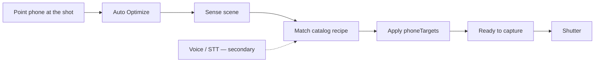
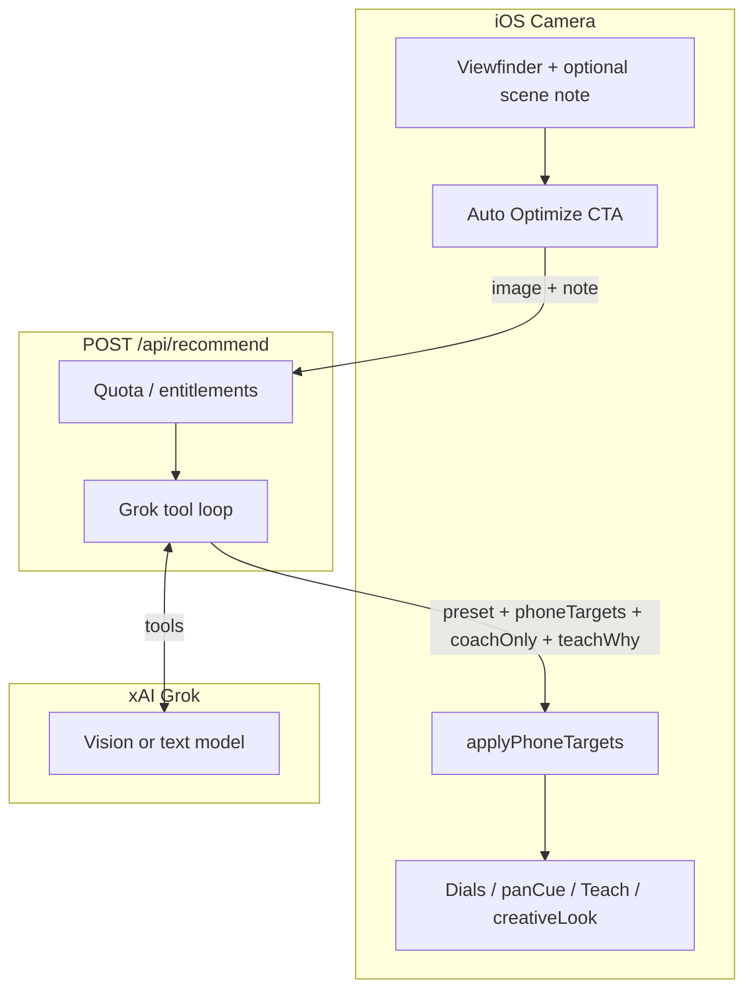
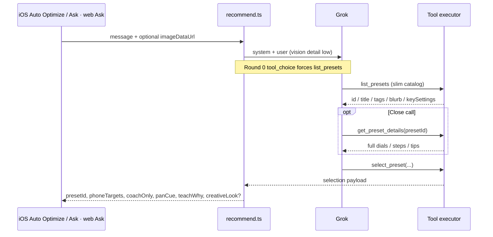
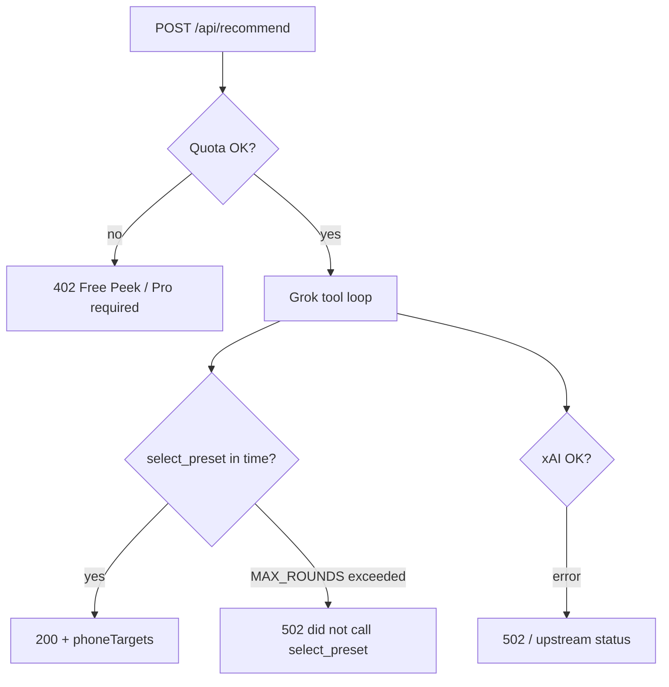
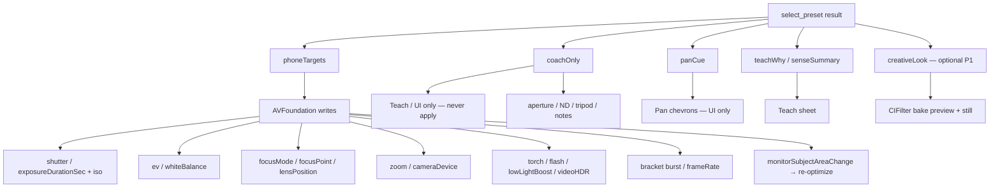
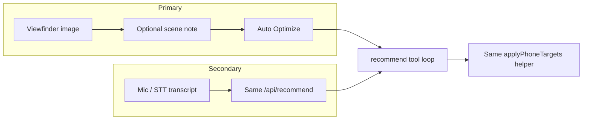
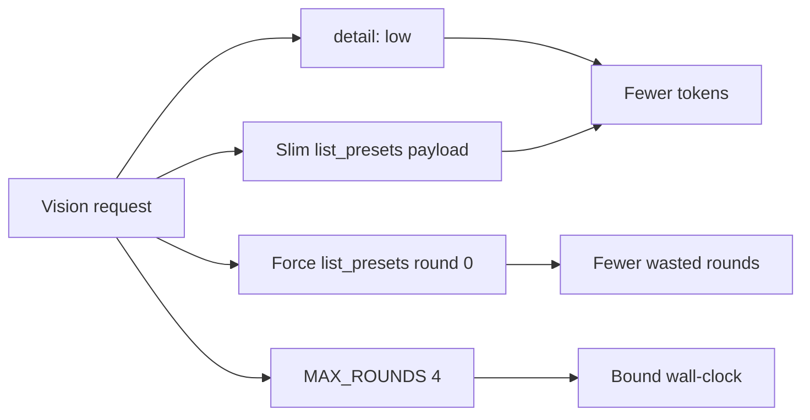

# Agentic Auto Optimize — flow charts

How Photo Recipes runs **Sense → Reason → Act → Verify** for from-viewfinder Auto Optimize.
**Verify** is a mental check before `select_preset` (not a fourth tool).  
Voice/STT is an **alternate input** into the same apply path — never the product lead.

Canonical schema/prompt: [`agentic-prompt-v2.md`](./agentic-prompt-v2.md) · iOS apply: [`CameraSession.applyPhoneTargets`](../ios/PhotoRecipes/Services/CameraSession.swift).

---

## 1. Product path (what the photographer sees)

Status copy examples: `Reading light…` → `Matching recipe…` → `Applying…` → `Ready to capture`.

---

## 2. End-to-end system

Clients: **iOS** Auto Optimize / Ask · **web** Ask & Photo Vision. Same API; only iOS runs `applyPhoneTargets` on AVCapture.

### Pass 1 vs Pass 2

| Pass | Where | What |
|------|-------|------|
| **1** | On-device | Instant local sense / recipe pick (no Grok) |
| **2** | Cloud | This tool loop via `/api/recommend` (quota-gated) |

---

## 3. Server tool loop (bounded)

**Bounds:** `MAX_ROUNDS = 4`. Finish with `select_preset` promptly — do not re-list.

**Verify:** before calling `select_preset`, the model mentally checks targets vs scene — there is **no** `verify_*` tool.

### Failure / bound paths

| Outcome | Typical cause |
|---------|----------------|
| `402` | Free Peek daily limit |
| `502` — no `select_preset` | Model never finalized within `MAX_ROUNDS` |
| `502` / `4xx` from xAI | Model/key/vision availability |

---

## 4. Act: what gets applied vs coach-only

**Never applied as device writes:** mechanical aperture, ND, tripod, `previewLUT` (preview-only), `simulatedAperture` (coach unless future OS API).

---

## 5. Primary vs secondary input

Spoken intents still map into `phoneTargets` (e.g. “slower shutter for panning”, “warm film look” → `creativeLook`).

---

## 6. Latency knobs (server)

Rough wall times after these knobs: **text ~5–10s** · **vision ~20–40s** (not sub-second). Client timeouts: **60s** request / **120s** resource.

---

## Related

- [`agentic-prompt-v2.md`](./agentic-prompt-v2.md) — prompts, schemas, failure modes  
- [`design-handoff-agentic-v1.md`](./design-handoff-agentic-v1.md) — UI / status chrome  
- [`agents/agentic-expert.md`](./agents/agentic-expert.md) — ownership
